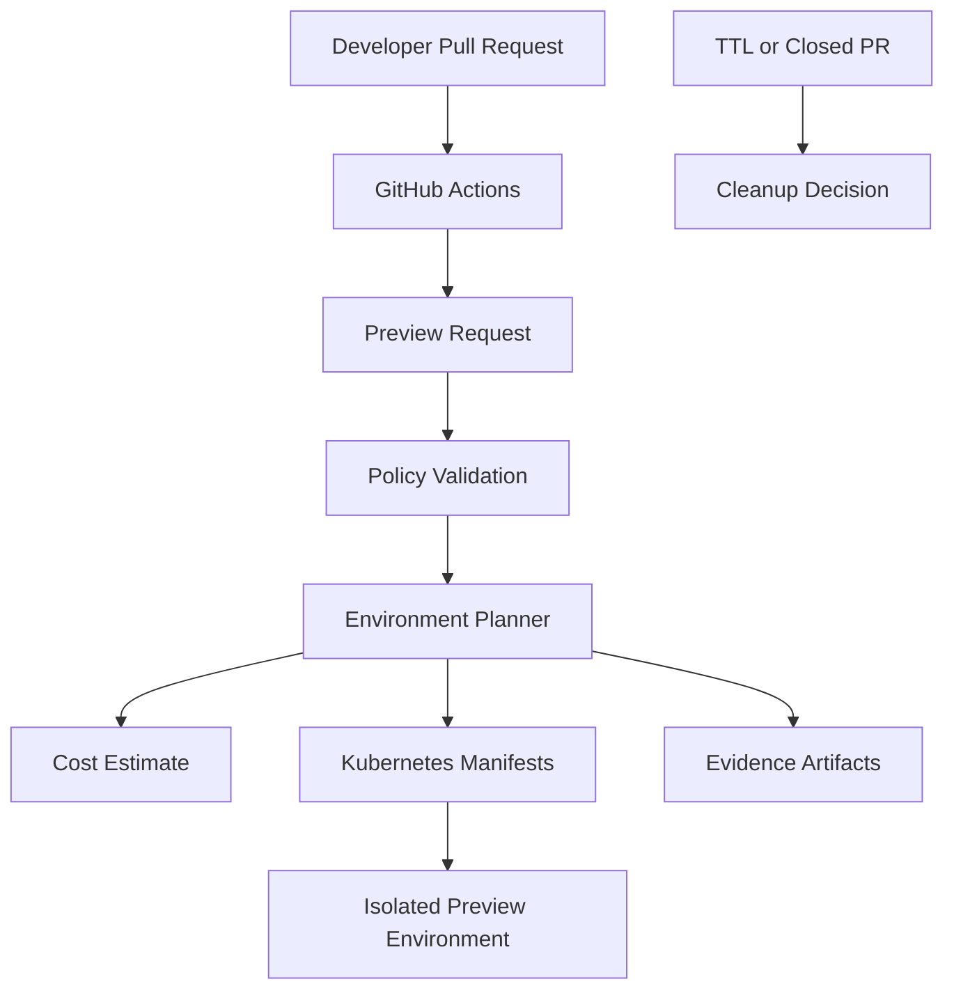

# Self-Service Ephemeral Environment Platform

[](https://github.com/hemantsharma2189/self-service-ephemeral-environment-platform/actions/workflows/ci.yml)
[](https://github.com/hemantsharma2189/self-service-ephemeral-environment-platform/actions/workflows/container-security.yml)
[](https://www.python.org/)
[](https://kubernetes.io/)
[](LICENSE)

A PR-driven platform that generates secure, temporary Kubernetes preview-environment plans with isolated namespaces, resource quotas, unique URLs, TTL cleanup decisions, cost estimates and deployment evidence.

## Why this project?

Development teams often need a safe environment to review application changes before merging a pull request. Creating and removing those environments manually is slow, inconsistent and expensive.

This project provides a self-service workflow that converts pull-request metadata into a validated preview-environment plan without automatically creating cloud resources.

It demonstrates:

- Platform engineering and developer self-service
- Pull-request driven automation
- Kubernetes multi-environment design
- Policy-based configuration validation
- Cost-aware resource planning
- TTL and pull-request lifecycle cleanup
- CI/CD evidence and security scanning

## Architecture



Detailed architecture: [docs/architecture.md](docs/architecture.md)

## Core capabilities

- YAML-based preview-environment requests
- Strict Pydantic validation
- Immutable container image enforcement
- Maximum 72-hour TTL policy
- Unique PR-based environment names and URLs
- Dedicated Kubernetes namespaces
- ResourceQuota generation
- Secure Deployment, Service and Ingress generation
- CPU and memory cost estimation
- TTL and closed-pull-request cleanup decisions
- JSON, Kubernetes YAML and Markdown evidence
- PR-triggered GitHub Actions workflow
- Secure non-root Docker image
- Automated tests, linting and Trivy scanning

## Repository structure

```text
.
├── src/preview_env/
│   ├── cli.py
│   ├── config.py
│   ├── cost.py
│   ├── lifecycle.py
│   ├── models.py
│   ├── planner.py
│   ├── renderer.py
│   └── service.py
├── examples/
│   └── preview-request.yaml
├── tests/
├── docs/
├── Dockerfile
└── .github/workflows/
```

## Example request

```yaml
repository: sample-cloud-application
pull_request_number: 42
commit_sha: a1b2c3d4e5f678901234567890abcdef12345678
image: nginx:1.27.5-alpine
owner: hemant-sharma
ttl_hours: 8
container_port: 8080
dry_run: true
```

## Run locally

Install the project:

```bash
python -m pip install -e ".[dev]"
```

Generate a safe preview plan:

```bash
preview-env examples/preview-request.yaml
```

The command creates:

```text
artifacts/sample-cloud-application-pr-42/
├── manifests.yaml
├── plan.json
└── summary.md
```

## Run with Docker

Build the image:

```bash
docker build -t preview-environment-platform .
```

Run the default dry-run example:

```bash
docker run --rm preview-environment-platform
```

## Pull-request automation

When a pull request is opened, reopened or updated, GitHub Actions:

1. Collects pull-request metadata.
2. Creates a validated request.
3. Generates the environment plan.
4. Renders Kubernetes manifests.
5. Estimates resource cost.
6. Uploads evidence as a workflow artifact.

The workflow runs in dry-run mode and does not deploy infrastructure automatically.

## Generated Kubernetes resources

Each plan includes:

- Isolated Namespace
- ResourceQuota
- Secure single-replica Deployment
- ClusterIP Service
- Ingress with a unique PR hostname
- Ownership, commit and TTL metadata

## Cleanup logic

The lifecycle engine recommends deletion when:

- The associated pull request closes, or
- The environment exceeds its configured TTL.

Cleanup decisions are tested locally. Automatic cluster deletion is intentionally not enabled because this portfolio repository is not connected to a live Kubernetes cluster.

## Automated validation

GitHub Actions performs:

- Ruff code-quality checks
- Unit tests and coverage
- Dry-run artifact generation
- Evidence upload
- Docker image build
- Container execution test
- Trivy vulnerability scan

## Project status

- Request validation: Complete
- Environment planning: Complete
- Kubernetes manifest rendering: Complete
- Cost estimation: Complete
- TTL cleanup decision engine: Complete
- Pull-request dry-run workflow: Complete
- Automated testing and security scanning: Passing
- Live Kubernetes deployment: Not performed

## Author

**Hemant Sharma**

- GitHub: [hemantsharma2189](https://github.com/hemantsharma2189)
- LinkedIn: [hemantsharma20](https://www.linkedin.com/in/hemantsharma20/)
- Portfolio: [hemantsharma2189.github.io](https://hemantsharma2189.github.io/)

## License

Licensed under the [MIT License](LICENSE).
