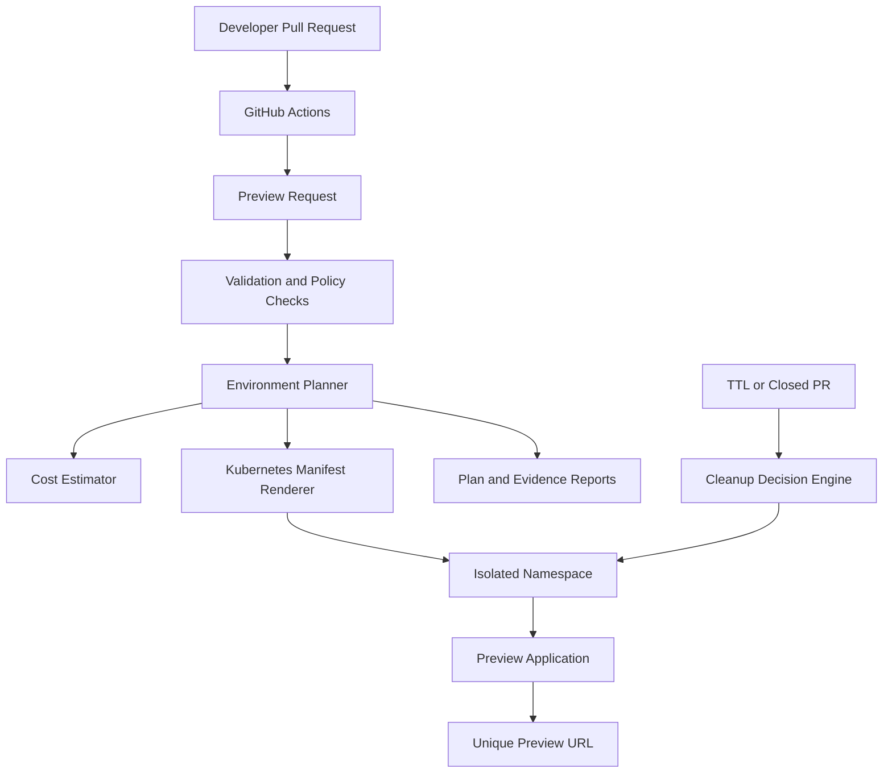

# Self-Service Ephemeral Environment Platform Architecture

## Provisioning flow

1. A developer opens or updates a pull request.
2. GitHub Actions creates a preview environment request.
3. Pydantic validates repository, image, TTL, resource and ownership settings.
4. The planner creates a unique environment name, namespace and preview URL.
5. The cost engine estimates CPU and memory usage for the configured TTL.
6. The renderer generates Namespace, ResourceQuota, Deployment, Service and Ingress manifests.
7. Plan, manifest and Markdown evidence artifacts are uploaded to GitHub Actions.
8. The cleanup engine marks the environment for deletion when the pull request closes or its TTL expires.

## Safety controls

- Dry-run execution is enabled by default.
- Mutable `latest` container tags are rejected.
- Environment TTL is limited to 72 hours.
- Every preview uses an isolated Kubernetes namespace.
- CPU, memory and pod quotas limit resource consumption.
- Containers run without privilege escalation or service-account token mounting.
- Generated evidence is retained for review.
- No cloud resources are deployed automatically.
